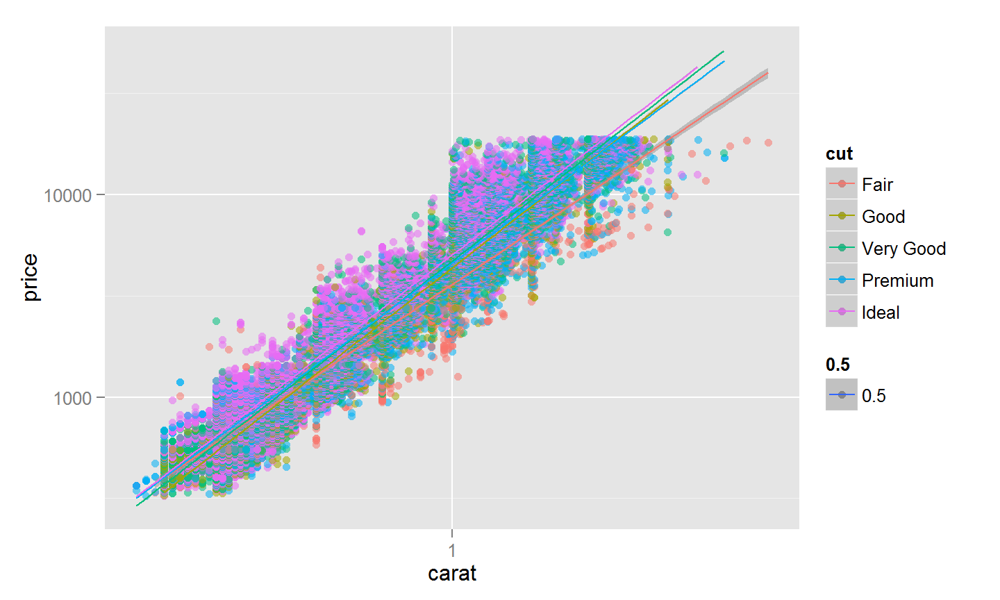

# Introduction to ggplot2
Myfanwy Johnston  
Wednesday, March 11, 2015  


##Getting started

```r
install.packages("ggplot2")
require(ggplot2)

# Data Note: ggplot2 requires data.frames
```
## Logic of ggplot2
 - Based on the Grammar of Graphics
 - Layerable graphics with an underlying structure to the syntax


##Arguments of ggplot(..., layer())

### Data 

  * gets pulled into the ggplot() function
  * variables in the data are mapped to various _aesthetics_
  
##Arguments of ggplot(..., layer())

### Aesthetics

  * how your data are represented visually
      - aes(x = , y = , )
      - aes(color = , shape = , fill = , size = , alpha = )
    
##Arguments of ggplot(..., layer())

### Geometry 

* Essentially determines the type of graph  
    - bar, histogram, line, point, etc
    
##Arguments of ggplot(..., layer())

### Statistic

  * the statistical transformation.  
  * Default is 'identity', but lots of others possible: 
      - bin, density, boxplot, contour
      
##Arguments of ggplot(..., layer())

### Facet

* Do you want to plot subsets of your data?
    - facet_wrap(~var, nrows/ncols = )
    - facet_grid(~var)
    
##Arguments of ggplot(..., layer())

### Scales: 

* Need one for each aesthetic mapping 
  - x scale, y scale
  - scale transformation of shapes and colors (think color mapping)

##Arguments of ggplot(..., layer())

### Coordinate System

* default is Cartesian

Full ggplot() specification:
----

```r
ggplot() +
  layer(
    data = diamonds, mapping = aes(x= carat, y = price, color = cut, alpha = 0.5) ,
    geom = "point" , stat = "identity" , position = "identity"
    ) +
  layer(
   data = diamonds, mapping = aes(x = carat, y = price) ,
   geom = "smooth" , stat = "smooth" , method = lm, position = "identity" ,
   ) +
  scale_y_log10() +
  scale_x_log10() +
  coord_cartesian()
```
Translation: using the diamonds data set, map _'carat'_ to horizontal (x) position and _'price'_ to vertical (y) position.  Display the raw data with points that are colored according to the variable _'cut'_. Finally, add a smoothing line with all of the same data mapping onto a log-transformed axis scale.

The code on that last slide gives us {.build}
---
 
...a mess


## This slide is blank on purpose.

## The magic of defaults

Allow us to simplify the full ggplot() specification to:

```r
ggplot(diamonds, aes(carat, price)) + geom_point() +
  stat_smooth(method = lm) +
  scale_y_log10() +
  scale_x_log10()
```

## A few thoughts on qplot()

>- Makes strong assumptions in order to reduce the amount of typing
>- Mimics syntax of plot()
>- In my experience, using qplot() at the beginning delays full understanding of ggplot() syntax
>- Recommend starting with ggplot(), then relying on qplot() once you're comfortable with full ggplot()

## Horoscopic advice:
> - ggplot2's syntax will make the most sense when you already have an picture in your head of what you want the plot to look like.
> - Take the time to learn the structure of ggplot and its syntax
    * diving in with your own data will speed this up
> - start with the most basic graph you need, and build to the most complicated, learning about layers and aesthetic mappings as you need them

## Tag Life Study
> - Old tags, dropped them in a tank with a receiver to see how many days of life they still had.
> - Experimental setup:
      - Three tanks, each with a receiver and a temperature logger
      - one of the tanks has 10 tags; one removed from dataset because it didn't activate
      - each tag pings its unique ID on a random delay between 30 - 60 seconds
      - receiver records detections
  
## Plots I'd like to see:
  * Temperature in all three tanks
  * Total number of detections per tag
  * Detections over time (expecting to fall off)
    - Detections over time, by tag ID
  * Tag life
  
## This slide is blank on purpose

## ggplot2 FAQ (good name for a band?)
  * How do I add error bars?

```r
p + geom_errorbar(aes(x = , ymax = , ymin = )) #required aesthetics
```
  * How do I save a plot I've made?

```r
ggsave("plot.png" , plot = last_plot() , width = , height = , units = )
```
  * What should I do to make my life easier when using ggplot2?
  
      >- Have tidy data, watch your data classes, and bookmark the [ggplot2 FAQ on Stack Overflow](http://stackoverflow.com/questions/tagged/ggplot2?sort=faq).

---
<div align="center">  </div>
---

## Of course.
<br>
This repo on [GitHub](https://github.com/Myfanwy/ggplot2Intro) - all materials, including slides
<br>
Also has links to more teaching resources on all these things
